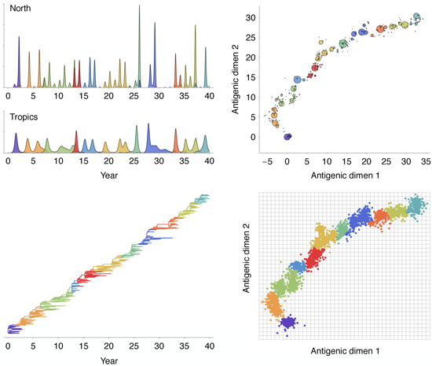

# Simulating virus evolution and epidemiology

Antigen implements an SIR epidemiological model where hosts in a population are infected with
viruses that have distinct antigenic phenotypes.  Hosts make contacts trasmitting viruses and also
recover from infection.  After recovery, a host remembers the antigenic phenotype it was infected
with as part of its immune history.  The risk of infection after contact depends on comparing the
infecting virus's phenotype to the phenotypes in the host immune history.

Antigenic phenotype is currently implemented as a *n*-d continuous vector.  Virus mutations move
phenotype randomly in this *n*-d Euclidean space.  However, other phenotype models may be
implemented through the Phenotype interface.

Additionally, population structure is implemented in terms of discrete demes.  Contacts within a
deme occur through standard mass action, while contacts between demes occur at some fraction of the
rate of within deme contact.

-------------------------------------------

I haven't made a makefile.  The program can be compiled with:

	javac *.java

Then to run the simulation:

	java -Xmx1G Antigen

The `-Xmx1G` is required, because as an individual-based model, the memory requirements are
typically quite large. Each host requires a minimum of 40 bytes of memory, plus 8 bytes per
Phenotype recorded in its immune history.  If the yearly attack rate is 15% and the host life span
is 30 years, at equilibrium the average size of the immune history will be 4.5 references.  This
gives memory usage of: population size x 76 bytes.  With 7.5 million hosts (used in the default
parameters), the equals 570MB.

In addition to hosts and immune histories, the simulation tracks the virus genealogy through
VirusTree.  This is harder to profile, and will continually grow in memory usage throughout the
simulation.  With the default parameters, VirusTree takes 5.5 MB at the end of a simulated year and
may up to 110 MB at the end of the default 20 simulated years.

All the relevant simulation parameters are contained in `Parameters.java`.  Unfortunately, this
means that changing parameter values requires a recompile.

The simulation will output a timeseries of region-specific prevalence and incidence to
`out.timeseries`.  It will also sample viruses periodically and output their geographic and
antigenic locations to `out.tips` and a tree connecting these samples to `out.branches`.  This file
contains pairs of viruses, child and parent, representing nodes in a genealogy.

If you have Mathematica, you can generate a number of figures from this output by running the
notebook `antigen-analysis.nb`.

-------------------------------------------

Copyright Trevor Bedford 2010-2012. Distributed under the GPL v3.